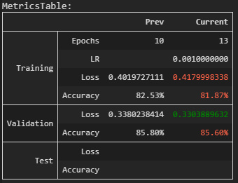

# Summary of the snippets included in this folder

## print_metrics.py
Print color-coded TensorFlow metrics in IPython 
    for Training, Validation and Test data or datasets in tabular format, 
    comparing those with the another metrics (such as previous history), if any, e.g. 

Printing validation and test metrics is optional. 
While validation metrics are read from history objects, test metrics are evaluated on the fly (if models are provided).

The metrics can be variable in number. 
If you are comparing metrics, it's good to have the same types of metrics in previous and current histories. 
This snippet will work in any case, but what it shows may not be correct if the histories provided are incorrect.

